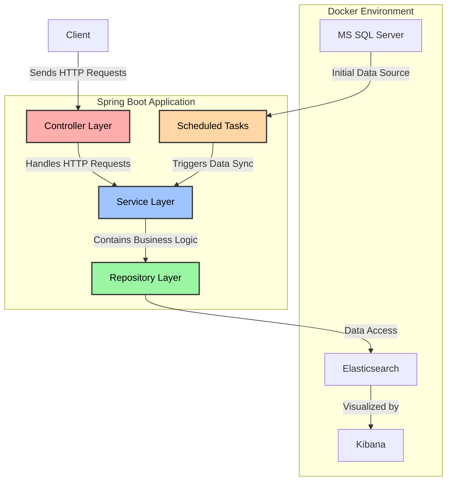
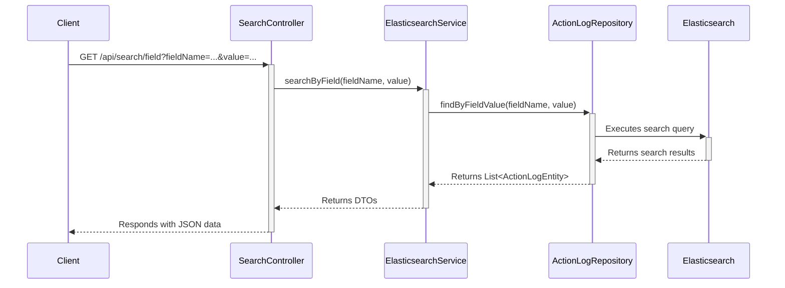
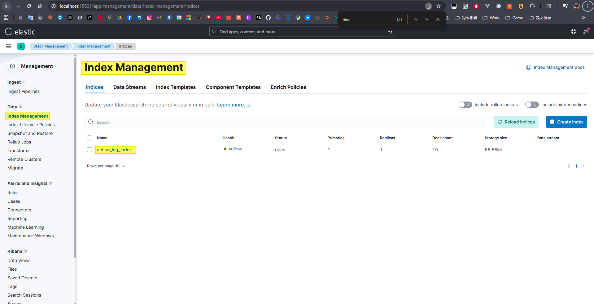
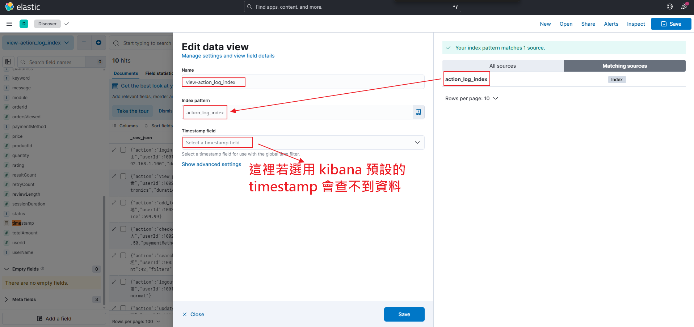
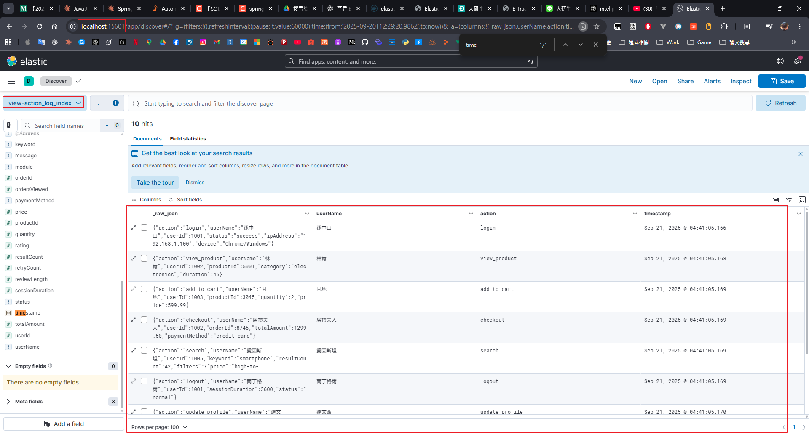

# Spring Boot with Elasticsearch Demo

This project is a demonstration of a Spring Boot application that integrates with Elasticsearch. It includes functionalities for data synchronization from a relational database (MSSQL) to Elasticsearch and provides a search API.

## 1. 主要套件說明及版本 (Main Packages and Versions)

### Application
| Package | Version | Description |
| --- | --- | --- |
| Java | 25 | Runtime environment |
| Spring Boot | 3.5.6 | Core application framework |
| Elasticsearch Java Client | 8.11.0 | Official Java client for Elasticsearch |

### Docker Environment
| Service | Image | Version | Description |
| --- | --- | --- | --- |
| Elasticsearch | docker.elastic.co/elasticsearch/elasticsearch | 8.11.0 | Search and analytics engine |
| Kibana | docker.elastic.co/kibana/kibana | 8.11.0 | Visualization and management UI for Elasticsearch |
| MS SQL Server | mcr.microsoft.com/mssql/server | 2022-latest | Relational database for initial data |

## 2. 程式架構說明 (Application Architecture)

The application follows a standard layered architecture common in Spring Boot projects.



- **Controller Layer (`SearchController`)**: Exposes RESTful endpoints for clients to perform search queries.
- **Service Layer (`ElasticsearchService`, `SyncService`)**:
    - `ElasticsearchService`: Contains the core logic for querying data from Elasticsearch.
    - `SyncService`: Handles the synchronization of data from MS SQL Server to Elasticsearch.
- **Repository Layer (`ActionLogRepository`)**: A Spring Data repository providing an abstraction for accessing data in Elasticsearch.
- **Scheduled Tasks (`SchedulingConfig`, `SyncService`)**: A scheduled job runs periodically to keep the Elasticsearch index updated with the data from MS SQL Server.

## 3. 請求流程 (Request Flow)

The following sequence diagram illustrates the flow of a typical search request.



## 4. 如何啟動 (How to Start)

1.  **啟動 Docker 容器**:
    在專案根目錄開啟終端機，並執行以下指令。這將會啟動 MS SQL Server, Elasticsearch, 和 Kibana。`mssql-setup` 服務也會自動運行以建立和初始化資料庫。
    ```bash
    docker-compose up -d
    ```

2.  **運行 Spring Boot 應用程式**:
    您可以透過兩種方式運行此應用程式：
    - **使用您的 IDE**: 直接運行 `SpringBootElasticsearchApplication.java` 中的 `main` 方法。
      - 若 docker 環境中尚未有啟動過的 docker-compose 容器，會自動啟動
    - **使用 Maven**: 開啟一個新的終端機並執行以下指令。
        ```bash
        ./mvnw spring-boot:run
        ```

3.  **存取服務**:
    - **應用程式 API**: `http://localhost:8080`
    - **Kibana**: `http://localhost:15601`
    - **Elasticsearch**: `http://localhost:19200`
    - **MS SQL Server**: 透過 `12345` 連接埠進行連線

## 5. HTTP 測試說明 (HTTP Test Explanation)

`http_test/查詢測試.http` 檔案包含了一系列用於測試搜尋 API 的範例請求。您可以使用內建 REST 客戶端的 IDE (例如 IntelliJ IDEA 或安裝了 "REST Client" 擴充功能的 Visual Studio Code) 來直接執行這些請求。

只需打開 `查詢測試.http` 檔案，然後點擊每個 URL 旁邊出現的 "Send Request" 按鈕或連結即可。

## 6. Kibana 驗證 (Kibana Verification)

應用程式啟動後，`SyncService` 會自動將資料從 MS SQL Server 同步到 Elasticsearch 的 `action_log_index` 索引中。您可以使用 Kibana 來查看和驗證這些資料。

1.  **前往索引管理**:
    打開 Kibana (`http://localhost:15601`)，前往 "Stack Management" -> "Index Management"，您可以看到 `action_log_index` 已經被建立。
    

2.  **建立 Data View**:
    前往 "Discover" 區塊。Kibana 會提示您建立一個 "Data View"。使用 `action_log_index` 作為名稱或 pattern。
    

3.  **探索與查詢資料**:
    建立 Data View 後，您就可以使用 Discover 工具來查看索引中的所有文件並執行查詢。
    
